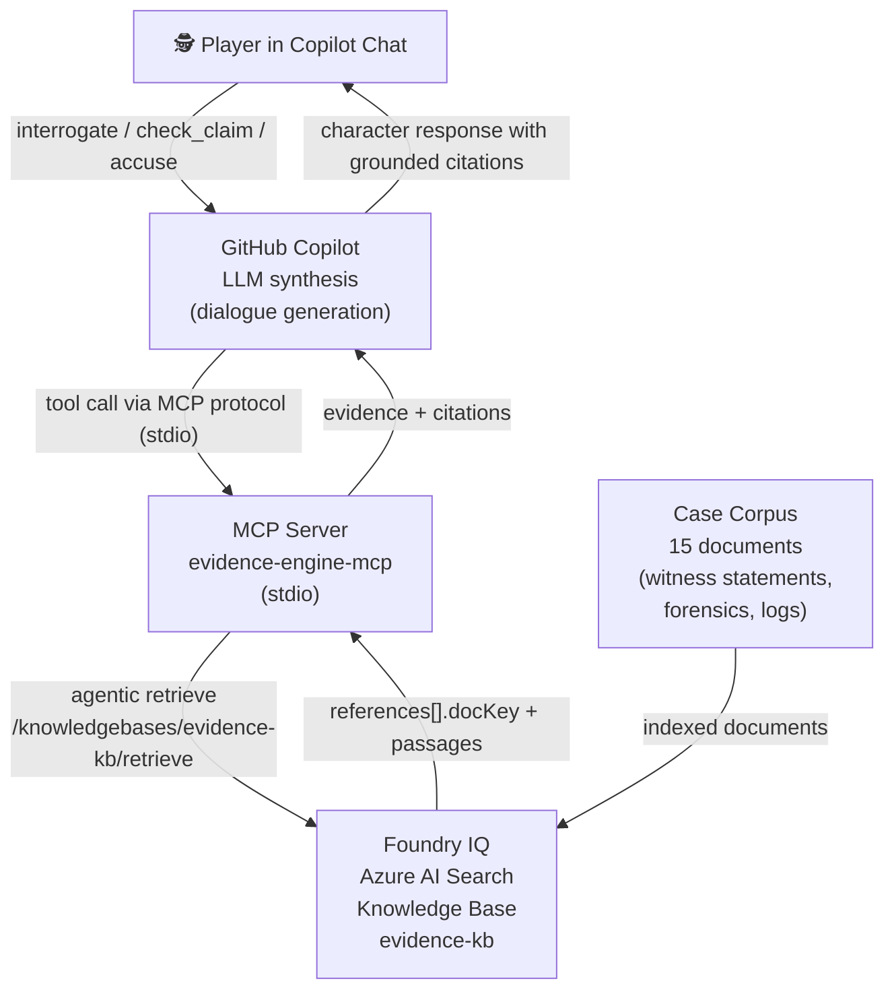
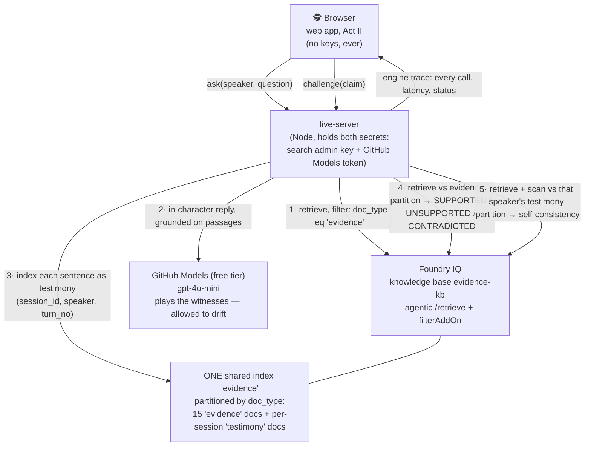

# Evidence Engine

> "An AI witness lies to your face. **Foundry IQ catches it live** — its knowledge base reads the case file, reasons over it with answer synthesis, and returns the verdict with a verbatim cited receipt. Then bring your *own* source — a doc, your notes, a chunk of code — and put the AI on the stand grounded in your material. We turned hallucination-detection into gameplay."

**Track:** Creative Apps with GitHub Copilot  
**Hackathon:** Agents League (Microsoft), June 4–14, 2026  

---

## Judge in 2 minutes

1. **Play instantly (offline, no keys, no backend):** open the hosted app *(hosting
   link — pending)* or `cd evidence-engine/web && npm install && npm run dev`. The
   live interrogation is the front door; for a zero-setup taste, click **"Offline
   demo · no keys"** to reach the scripted example case — press the claim
   *"I left at a quarter to eight"* and watch the `CONTRADICTED` stamp cite the badge
   log, verbatim.
2. **See Foundry IQ as the brain (live):**
   ```bash
   cd evidence-engine/live-server && npm install && npm run build
   cp .env.example .env   # Azure search endpoint + admin key; a model bound to the KB;
   #                        IQ_VERDICT_ENABLED=true · KB_REASONING_EFFORT=medium
   #                        GITHUB_MODELS_TOKEN=$(gh auth token)
   npm start              # then, in another shell: cd ../web && npm run dev
   ```
   Ask Helena when she left; challenge the time. The knowledge base runs **answer
   synthesis** and returns the `CONTRADICTED` verdict with the deciding passage quoted
   verbatim — the engine-tap panel shows the live `AZURE` reasoning step producing it.
   Flip **"pull the plug"** off and the catch collapses: her word stands.
3. **Bring your own trial:** from the front page, paste your own doc, notes, or code.
   Foundry IQ indexes it, infers the witnesses, and checks each thing they say against
   *your* source — `GROUNDED` / `CONTRADICTED` / `UNVERIFIABLE`, cited.
4. **Proof without running anything:** [`spike/output/08-retrieve-verdict.json`](spike/output/08-retrieve-verdict.json)
   is the raw KB answer-synthesis response that produces a verdict (`VERDICT:
   CONTRADICTED` + verbatim passage + `agenticReasoning` 10,155 tokens).
   [`evidence-engine/docs/live-mode-proof.json`](evidence-engine/docs/live-mode-proof.json)
   is a sanitized end-to-end trace; the full Azure provisioning trail (stage-by-stage
   log + committed raw responses, `@odata.context` naming the endpoint and API version)
   is in [`spike/README.md`](spike/README.md).

---

## What It Is

Evidence Engine is a detective game where you interrogate AI witnesses who lie — and **Foundry IQ catches them in the act.** When you challenge a claim, the Azure AI Search knowledge base retrieves the relevant case documents, a bound model reasons over them with **answer synthesis**, and the KB itself returns the verdict — `GROUNDED`, `CONTRADICTED`, or `UNVERIFIABLE` — with the deciding passage quoted verbatim. The verdict is produced by Foundry IQ, not by a hand-written rule; a deterministic check runs alongside it only as a **disclosed cross-check** (see [Responsible AI](#responsible-ai)).

The core mechanic: **a contradiction with a cited receipt is the win condition.** Pull the plug on Foundry IQ and the catch collapses — the witness's word stands. That toggle is in the UI.

### Two ways to play, one engine

- **The example case — *The Holbrooke Gallery Affair*.** A polished, deterministic murder mystery: three witnesses, one provable lie, a full accusation endgame. The reliable hero path.
- **Bring your own trial.** Paste *your own* source — a spec, your notes, a story, a snippet of code. Foundry IQ indexes it, infers 1–3 witnesses from the material, and puts them on the stand grounded only in what you pasted. The lies here are **emergent, not scripted** — the model invents, and Foundry IQ checks every claim against *your* source. This is real hallucination detection, on text we never saw.

Every catch files into a growing, exportable **Grounding Record** (kept / contradicted / unverifiable, each cited) — so you leave an interrogation with a cited document, not just a stamp. And the same verdict engine ships as an **MCP server for GitHub Copilot** (`ground_on` + `check_claim`): load your own file and have Copilot audit a claim — including one it just made about your code — against it, with a faithfulness gate.

### Three ways to play

| Surface | Where | What it gives you | Talks to Foundry IQ? |
|---------|-------|-------------------|----------------------|
| **Copilot Chat (MCP)** | VS Code, via the four MCP tools below | Free-form interrogation with LLM-synthesised dialogue, grounded by Foundry IQ retrieval | **Yes — live**, when Azure env vars are set (local keyword fallback otherwise, clearly labelled) |
| **Web: Act I · Training Case** | [`evidence-engine/web/`](evidence-engine/web/) — static, hostable anywhere, no keys | A noir detective desk: pressable claim chips that flip to stamped VERIFIED / CONTRADICTED / NO RECORD verdicts, an evidence board, a full-screen accusation set-piece. Citation quotes verified verbatim by tests. | **No — fully offline by design.** This is the judge-without-keys path; the UI never claims otherwise |
| **Web: Act II · Live Interrogation** | Same web app + [`evidence-engine/live-server/`](evidence-engine/live-server/) | **Open free-form chat with the suspects.** A live model plays each witness, grounded through a Foundry IQ retrieve on *every* turn — and deliberately allowed to drift. Every sentence becomes a challengeable claim, indexed into the knowledge base as testimony the moment it is spoken. Challenge any claim and the engine runs two live retrieves: one against the evidence partition, one against that witness's own earlier testimony. A wiretap-styled "engine tap" panel shows every live call (method, latency, status) in real time. | **Yes — live on every turn and every verdict.** If the backend is unreachable, the UI says "LINE DEAD" and points back to the Act I training case — it never silently substitutes local retrieval |

---

## Architecture



**Why Foundry IQ is load-bearing:** the verdict is *produced by the knowledge base*, not by our code. On a challenge, the KB runs answer synthesis (`outputMode: answerSynthesis`, reasoning effort `medium`, `gpt-4.1-mini` bound to `evidence-kb`) and returns the `VERDICT: CONTRADICTED` line plus the verbatim deciding passage and its `references[]`. There is no hardcoded "Helena is guilty"; remove the knowledge base and there is nothing to reason over, so the catch collapses — which is exactly what the in-UI "pull the plug" toggle demonstrates. The raw end-to-end response is committed at [`spike/output/08-retrieve-verdict.json`](spike/output/08-retrieve-verdict.json) (`modelQueryPlanning → searchIndex → modelAnswerSynthesis → agenticReasoning`, 10,155 reasoning tokens). A deterministic check runs alongside as a disclosed cross-check; when the two diverge, the IQ verdict leads and the divergence is shown in the engine tap.

**Three set-pieces make the reasoning visible.** Press **⚖ on/off** on any live claim for a side-by-side *split screen* — the same sentence with Foundry IQ unplugged (no record, her word stands) next to Foundry IQ in the loop (CONTRADICTED, cited). Every verdict carries a **receipt** — `Foundry IQ · medium effort · N reasoning tokens` — so the multi-step reasoning is on screen, not merely asserted. And a witness can be convicted by *her own earlier words*: each reply is indexed into Foundry IQ as she speaks, so challenging a later claim retrieves her turn-1 testimony and catches the self-contradiction, verbatim, with the turn number — the AI assembling the proof of its own drift as it talks.

### Live Interrogation architecture (Act II)



The drift is the game: the witness model is instructed to ground in retrieved passages but **not prevented** from inventing beyond them. The player's job is to catch it — and every verdict that catches it originates from a live knowledge-base call, visible in the engine tap. A sanitized end-to-end trace is checked in at [`evidence-engine/docs/live-mode-proof.json`](evidence-engine/docs/live-mode-proof.json).

---

## MCP Tools

| Tool | Input | What it does |
|------|-------|-------------|
| `load_case` | — | Returns the case briefing and suspect list |
| `interrogate` | `character`, `question` | Retrieves relevant case documents (Foundry IQ), returns evidence context + citations for Copilot to synthesise character dialogue |
| `ground_on` | `title`, `content` | **Copilot Receipts.** Indexes *your own* source (a file, notes, a doc) into Foundry IQ as its own partition, so `check_claim` audits against your material instead of the built-in case |
| `check_claim` | `claim` | Foundry IQ answer-synthesis verdict against the loaded source (or the case file): **GROUNDED / CONTRADICTED / UNVERIFIABLE**, with the verbatim citation, a **faithfulness gate** (PASS/HELD), and the reasoning-token count. Degrades to the deterministic cross-check if answer synthesis is unavailable — never fakes an IQ verdict |
| `accuse` | `suspect`, `evidence_doc_keys` | Evaluates the accusation: correct suspect + required evidence = case solved |

The Copilot story: `@ground_on` a file from your repo, then `@check_claim` a statement Copilot just made about it — if the source doesn't back it, the verdict is `HELD` with a cited line, so you don't act on an ungrounded claim. The verification engine lives where developers already work.

**Put your PR on the stand.** Point it at a diff: `@ground_on` the patch, then `@check_claim` each line of the PR description. *"Refactors the fetch wrapper"* → **GROUNDED** (PASS). *"Adds retry on 500s"* when the diff actually deletes the retry → **CONTRADICTED** (HELD), the removed line cited verbatim. *"Improves rate limiting"* when the diff is silent on it → **UNVERIFIABLE** (HELD) — the honest grey band: absence is not contradiction. The dullest dev chore becomes an interrogation, and Foundry IQ is the lie detector.

---

## Playing the Game

Add the MCP server to GitHub Copilot in VS Code:

**Option A: Via `.vscode/mcp.json`** (included in this repo — open `evidence-engine/` as the workspace folder in VS Code)

The bundled config is zero-configuration: the server starts immediately with no
prompts and no keys, using the clearly-labelled local fallback. To switch every
retrieval to live Foundry IQ, copy `server/.env.example` to `server/.env` and fill
in the two Azure values — the server picks them up on next start. A second entry,
`evidence-engine-foundry-iq`, exposes the knowledge base's **native MCP endpoint**
(zero glue code) and prompts for the admin key only if you start it.

**Option B: Manual** — add to your VS Code settings:

```json
{
  "mcp": {
    "servers": {
      "evidence-engine": {
        "type": "stdio",
        "command": "node",
        "args": ["/path/to/evidence-engine/server/dist/index.js"]
      }
    }
  }
}
```

Then in Copilot Chat (Agent mode):

```
@evidence-engine load_case
```

The game begins. Interrogate Helena, Felix, and Nora. Check their claims. Accuse when you're ready.

---

## Setup

### Quick Start (Dev Mode — no Azure required)

In dev mode the MCP server uses a local keyword search over the corpus files. Citations are file-based. The game mechanic works; the IQ integration requires Azure.

```bash
cd evidence-engine/server
npm install
npm run build
```

Configure VS Code (`.vscode/mcp.json` is already included). Open Copilot Chat and start interrogating.

### Full Setup (Foundry IQ)

1. Run the spike scripts in [`spike/`](spike/README.md) to provision Azure AI Search and create the knowledge base.
2. Copy `server/.env.example` to `server/.env` and fill in:
   - `AZURE_SEARCH_ENDPOINT`
   - `AZURE_SEARCH_KEY`
3. Upload the 15 corpus documents to the knowledge base (spike stage 2).
4. Rebuild and restart: `npm run build && npm start`

### Act II · Live Interrogation (web + live-server)

The live backend holds the two secrets; the browser never sees either.

```bash
# one-time: add partition fields to the live index ($0, additive)
cd spike && ./07-add-live-fields.sh

cd evidence-engine/live-server
npm install && npm run build
cp .env.example .env       # fill in AZURE_SEARCH_ENDPOINT + AZURE_SEARCH_ADMIN_KEY
# any GitHub token works for the free Models tier:
#   GITHUB_MODELS_TOKEN=$(gh auth token)
npm start                  # http://localhost:8787

# in another terminal
cd evidence-engine/web && npm run dev
# open http://localhost:5173 → press a claim in Act I, then switch to Act II
```

Verify the full loop against the live KB (writes the sanitized proof artifact):

```bash
cd evidence-engine/live-server && npm run test:live
```

---

## Responsible AI

### What Evidence Engine does

- Every character response is grounded in retrieved documents from the case file
- Citations are structural: the server fetches documents by `docKey` from the index to verify cited passages exist
- When retrieval returns nothing, the verdict is explicitly `UNVERIFIABLE` ("the source is silent") — it does not manufacture a contradiction or present unsupported claims as fact
- The game is designed for catch-the-lie gameplay; it does not claim characters are "truthful AI" or that the system is hallucination-proof

### What Evidence Engine does not do

- It does not generate unsupported factual claims as authoritative
- The built-in case uses no real crimes, real people, or real victims — it is entirely synthetic
- In **Bring your own trial**, the text you paste is indexed into Foundry IQ *only* to run that trial, in its own isolated partition. It is purged when you reset and swept automatically after a period of inactivity; the intake asks you to paste demo-safe text only (no personal, confidential, or copyrighted material). The built-in case stores no personal data.

### Limitations

- The LLM (GitHub Copilot) synthesises character dialogue between retrieval and the player. Synthesis can misparaphrase retrieved evidence. **The citations are provided so players can verify against the source document, not because synthesis is infallible.**
- Local dev mode uses keyword search, not semantic retrieval — results are less precise than Foundry IQ
- **Live interrogation is built around drift.** The witness model may invent details — that is the design, and the UI says so on screen. Verdicts are evidence-relative: "unsupported by the case file" or "conflicts with their earlier statement", never "false" or "lying" as findings of fact.
- **Scoring requires positive evidence.** Only CONTRADICTED (with a cited passage) or a self-contradiction counts as a catch. "The case file is silent" is flagged as *unverifiable* — never scored as a caught hallucination, because unverifiable ≠ false. Challenging supported claims costs you.
- **The verdict is Foundry IQ's, not a regex's.** On a challenge, the knowledge base runs answer synthesis over the retrieved passages and returns the verdict (`GROUNDED` / `CONTRADICTED` / `UNVERIFIABLE`) with the deciding passage quoted verbatim. A deterministic check (explicit negation phrases + clock-time conflicts within claim-relevant sentences) runs *alongside* as a disclosed cross-check; when it diverges from the IQ verdict, the IQ verdict leads and the divergence is surfaced in the engine tap. The tap tags every step `AZURE` (live Foundry IQ call), `MODEL` (GitHub Models witness), or `LOCAL` (the deterministic cross-check) — the split is disclosed, not discovered. *(The zero-config local fallback, run without Azure keys, uses the deterministic check alone and labels itself as such.)*
- **Ground truth where it matters.** In the Holbrooke case each witness is scripted to assert one planted fabrication, so the report can show how many plants you pinned — provably, not by heuristic opinion. In *Bring your own trial* there is no script: the lies are emergent, and the verdict is whatever Foundry IQ finds in *your* pasted source. The deterministic cross-check can still miss paraphrased contradictions and time-free testimony — the cited passages are shown verbatim so you remain the judge.
- **Copilot Receipts caveat.** Azure's content filter intermittently rejects answer synthesis on security-sensitive *code*; `check_claim` discloses this and degrades to the deterministic cross-check rather than crashing. The IQ verdict path is reliable on docs, notes, and prose.
- The self-consistency check only fires on conflicting clock times; two semantically contradictory but time-free statements will read as consistent.
- Retrieval thresholds are calibrated per query shape (question-style 3.5; declarative claims 2.0; testimony 1.0 — measured live, June 11 2026). Out-of-distribution phrasing can still fail closed ("the case file is silent") on claims the file does address.

---

## How I Used GitHub Copilot

See [COPILOT_USAGE.md](evidence-engine/COPILOT_USAGE.md) for the full log of Copilot interactions during development.

Highlights:
- Copilot Chat designed the MCP tool architecture and identified the citation integrity requirement
- Inline suggestions completed the MCP SDK scaffolding and Foundry IQ API calls
- Copilot provided the responsible AI framing: "characters may be unreliable narrators — the citations let you catch them"

---

## The Case

**The Holbrooke Gallery Affair** — a gallery owner is found dead in his private office. Three people were present that evening. One of them lied about when they left.

The planted contradiction is in the evidence. The security log and the witness statement disagree by over an hour. The forensic evidence corroborates the log. The motive is in a draft email the victim never sent.

Start with `load_case`. Good luck.
