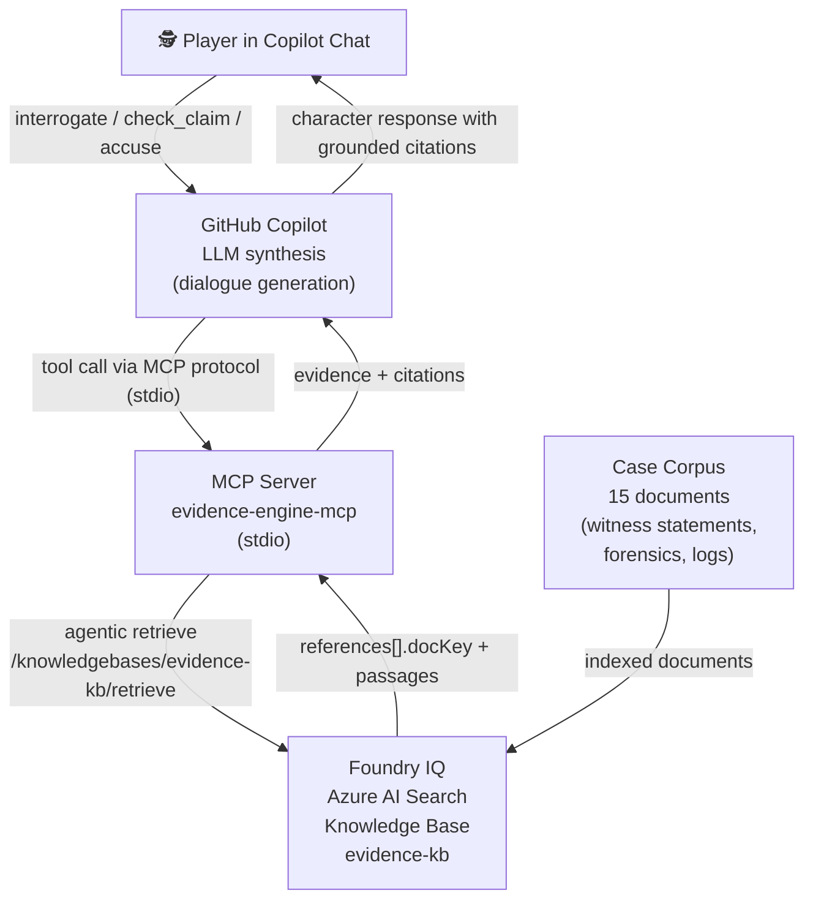

# Evidence Engine

> "Every AI lies sometimes. In Evidence Engine, every claim a character makes is backed by agentic retrieval over the case file, with citations — and when the evidence doesn't support a claim, the game knows. We turned hallucination-resistance into gameplay."

**Track:** Creative Apps with GitHub Copilot  
**Hackathon:** Agents League (Microsoft), June 4–14, 2026  

---

## What It Is

Evidence Engine is a detective game played inside GitHub Copilot Chat in VS Code. You interrogate suspects in a murder case. Every response is grounded in the actual case file via **Foundry IQ** (Azure AI Search agentic retrieval) — the characters cite their evidence, and you use those citations to catch them in lies.

The core mechanic: **citation integrity is the win condition.** One character lied. The security log proves it. Find it.

---

## Architecture



**Why Foundry IQ is load-bearing:** Remove the knowledge base and the game cannot function. There is no hardcoded "Helena is guilty." The `check_claim` tool retrieves the security log and surfaces the contradiction because the log is in the index. This is the only concept in our evaluation where the IQ layer was genuinely the game mechanic, not a decoration.

---

## MCP Tools

| Tool | Input | What it does |
|------|-------|-------------|
| `load_case` | — | Returns the case briefing and suspect list |
| `interrogate` | `character`, `question` | Retrieves relevant case documents, returns evidence context + citations for Copilot to synthesise character dialogue |
| `check_claim` | `claim` | Tests a factual claim against the case file — returns SUPPORTED, CONTRADICTED, or INSUFFICIENT\_EVIDENCE with document citations |
| `accuse` | `suspect`, `evidence_doc_keys` | Evaluates the accusation: correct suspect + required evidence = case solved |

---

## Playing the Game

Add the MCP server to GitHub Copilot in VS Code:

**Option A: Via `.vscode/mcp.json`** (included in this repo — open the workspace folder in VS Code)

**Option B: Manual** — add to your VS Code settings:

```json
{
  "mcp": {
    "servers": {
      "evidence-engine": {
        "type": "stdio",
        "command": "node",
        "args": ["/path/to/evidence-engine/server/dist/index.js"]
      }
    }
  }
}
```

Then in Copilot Chat (Agent mode):

```
@evidence-engine load_case
```

The game begins. Interrogate Helena, Felix, and Nora. Check their claims. Accuse when you're ready.

---

## Setup

### Quick Start (Dev Mode — no Azure required)

In dev mode the MCP server uses a local keyword search over the corpus files. Citations are file-based. The game mechanic works; the IQ integration requires Azure.

```bash
cd evidence-engine/server
npm install
npm run build
```

Configure VS Code (`.vscode/mcp.json` is already included). Open Copilot Chat and start interrogating.

### Full Setup (Foundry IQ)

1. Run the spike scripts in `../spike/` (see `spike/README.md`) to provision Azure AI Search and create the knowledge base.
2. Copy `server/.env.example` to `server/.env` and fill in:
   - `AZURE_SEARCH_ENDPOINT`
   - `AZURE_SEARCH_KEY`
3. Upload the 15 corpus documents to the knowledge base (spike stage 2).
4. Rebuild and restart: `npm run build && npm start`

---

## Responsible AI

### What Evidence Engine does

- Every character response is grounded in retrieved documents from the case file
- Citations are structural: the server fetches documents by `docKey` from the index to verify cited passages exist
- When retrieval returns nothing, the game explicitly returns `INSUFFICIENT_EVIDENCE` — it does not generate unsupported claims
- The game is designed for catch-the-lie gameplay; it does not claim characters are "truthful AI" or that the system is hallucination-proof

### What Evidence Engine does not do

- It does not generate unsupported factual claims as authoritative
- It does not use real crimes, real people, or real victims — the case is entirely synthetic
- It does not store or process any personal data

### Limitations

- The LLM (GitHub Copilot) synthesises character dialogue between retrieval and the player. Synthesis can misparaphrase retrieved evidence. **The citations are provided so players can verify against the source document, not because synthesis is infallible.**
- Local dev mode uses keyword search, not semantic retrieval — results are less precise than Foundry IQ

---

## How I Used GitHub Copilot

See [COPILOT_USAGE.md](evidence-engine/COPILOT_USAGE.md) for the full log of Copilot interactions during development.

Highlights:
- Copilot Chat designed the 4-tool architecture and identified the citation integrity requirement
- Inline suggestions completed the MCP SDK scaffolding and Foundry IQ API calls
- Copilot provided the responsible AI framing: "characters may be unreliable narrators — the citations let you catch them"

---

## The Case

**The Holbrooke Gallery Affair** — a gallery owner is found dead in his private office. Three people were present that evening. One of them lied about when they left.

The planted contradiction is in the evidence. The security log and the witness statement disagree by over an hour. The forensic evidence corroborates the log. The motive is in a draft email the victim never sent.

Start with `load_case`. Good luck.
