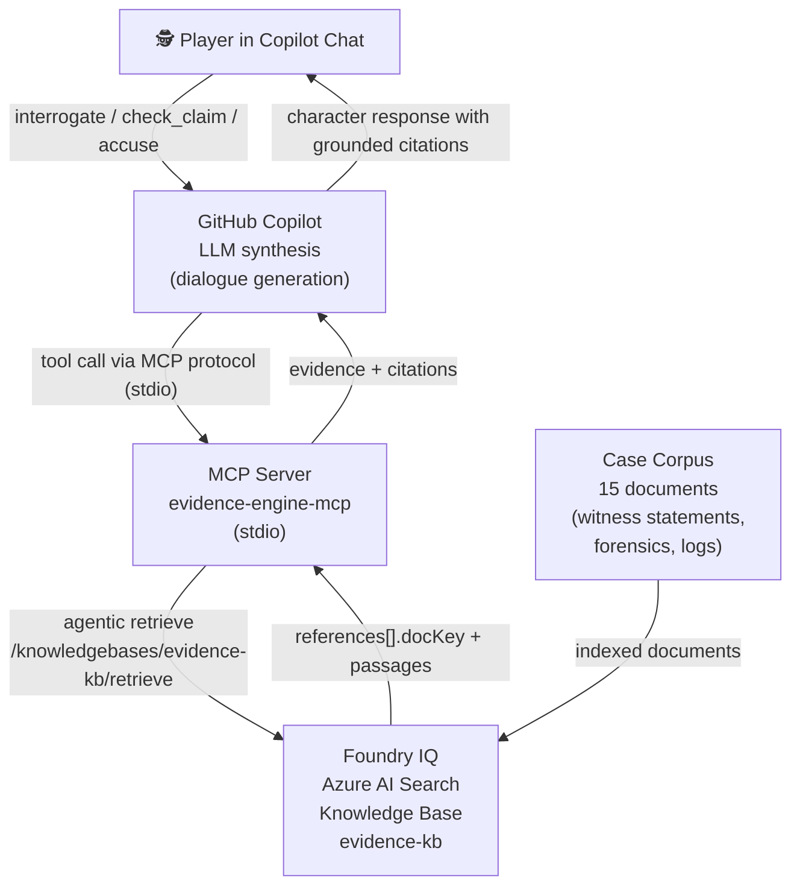
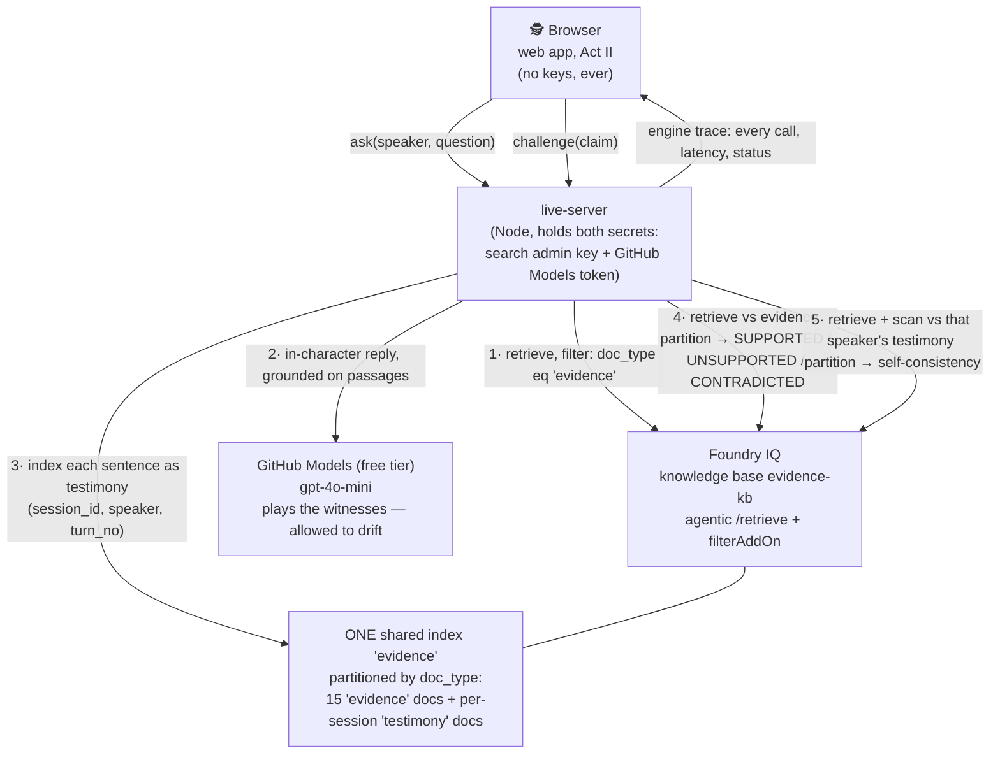

# Evidence Engine

> "Every AI lies sometimes. In Evidence Engine, every claim a character makes is backed by agentic retrieval over the case file, with citations — and when the evidence doesn't support a claim, the game knows. We turned hallucination-resistance into gameplay."

**Track:** Creative Apps with GitHub Copilot  
**Hackathon:** Agents League (Microsoft), June 4–14, 2026  

---

## Judge in 2 minutes

1. **Play instantly (no keys, no backend):** open the hosted app *(hosting link —
   pending)* or `cd evidence-engine/web && npm install && npm run dev`. Act I is the
   offline training case — it teaches the move in under a minute.
   Press the claim *"I left at a quarter to eight"* → watch the CONTRADICTED stamp cite
   the badge log, verbatim.
2. **See Foundry IQ live (3 commands):**
   ```bash
   cd evidence-engine/live-server && npm install && npm run build
   cp .env.example .env   # search endpoint+key; GITHUB_MODELS_TOKEN=$(gh auth token)
   npm start              # then: cd ../web && npm run dev → switch to Act II · Live interrogation
   ```
   Ask Helena when she left. Challenge the time she gives you. The engine-tap panel
   logs every live knowledge-base call — retrieval, testimony indexing, verdict — as
   it happens.
3. **Proof without running anything:** [`evidence-engine/docs/live-mode-proof.json`](evidence-engine/docs/live-mode-proof.json)
   is a sanitized end-to-end trace against the live KB; the design reasoning is in
   [`evidence-engine/docs/design-log.md`](evidence-engine/docs/design-log.md). The full
   Azure provisioning trail — stage-by-stage run log plus the committed raw responses
   from the live service (timestamped, `@odata.context` naming the endpoint and API
   version) — is in [`spike/README.md`](spike/README.md).

---

## What It Is

Evidence Engine is a detective game played inside GitHub Copilot Chat in VS Code. You interrogate suspects in a murder case. Every response is grounded in the actual case file via **Foundry IQ** (Azure AI Search agentic retrieval) — the characters cite their evidence, and you use those citations to catch them in lies.

The core mechanic: **citation integrity is the win condition.** One character lied. The security log proves it. Find it.

### Three ways to play

| Surface | Where | What it gives you | Talks to Foundry IQ? |
|---------|-------|-------------------|----------------------|
| **Copilot Chat (MCP)** | VS Code, via the four MCP tools below | Free-form interrogation with LLM-synthesised dialogue, grounded by Foundry IQ retrieval | **Yes — live**, when Azure env vars are set (local keyword fallback otherwise, clearly labelled) |
| **Web: Act I · Training Case** | [`evidence-engine/web/`](evidence-engine/web/) — static, hostable anywhere, no keys | A noir detective desk: pressable claim chips that flip to stamped VERIFIED / CONTRADICTED / NO RECORD verdicts, an evidence board, a full-screen accusation set-piece. Citation quotes verified verbatim by tests. | **No — fully offline by design.** This is the judge-without-keys path; the UI never claims otherwise |
| **Web: Act II · Live Interrogation** | Same web app + [`evidence-engine/live-server/`](evidence-engine/live-server/) | **Open free-form chat with the suspects.** A live model plays each witness, grounded through a Foundry IQ retrieve on *every* turn — and deliberately allowed to drift. Every sentence becomes a challengeable claim, indexed into the knowledge base as testimony the moment it is spoken. Challenge any claim and the engine runs two live retrieves: one against the evidence partition, one against that witness's own earlier testimony. A wiretap-styled "engine tap" panel shows every live call (method, latency, status) in real time. | **Yes — live on every turn and every verdict.** If the backend is unreachable, the UI says "LINE DEAD" and points back to the Act I training case — it never silently substitutes local retrieval |

---

## Architecture



**Why Foundry IQ is load-bearing:** Remove the knowledge base and the game cannot function. There is no hardcoded "Helena is guilty." The `check_claim` tool retrieves the security log and surfaces the contradiction because the log is in the index. This is the only concept in our evaluation where the IQ layer was genuinely the game mechanic, not a decoration.

### Live Interrogation architecture (Act II)



The drift is the game: the witness model is instructed to ground in retrieved passages but **not prevented** from inventing beyond them. The player's job is to catch it — and every verdict that catches it originates from a live knowledge-base call, visible in the engine tap. A sanitized end-to-end trace is checked in at [`evidence-engine/docs/live-mode-proof.json`](evidence-engine/docs/live-mode-proof.json).

---

## MCP Tools

| Tool | Input | What it does |
|------|-------|-------------|
| `load_case` | — | Returns the case briefing and suspect list |
| `interrogate` | `character`, `question` | Retrieves relevant case documents, returns evidence context + citations for Copilot to synthesise character dialogue |
| `check_claim` | `claim` | Tests a factual claim against the case file — returns SUPPORTED, CONTRADICTED, or INSUFFICIENT\_EVIDENCE with document citations |
| `accuse` | `suspect`, `evidence_doc_keys` | Evaluates the accusation: correct suspect + required evidence = case solved |

---

## Playing the Game

Add the MCP server to GitHub Copilot in VS Code:

**Option A: Via `.vscode/mcp.json`** (included in this repo — open `evidence-engine/` as the workspace folder in VS Code)

The bundled config is zero-configuration: the server starts immediately with no
prompts and no keys, using the clearly-labelled local fallback. To switch every
retrieval to live Foundry IQ, copy `server/.env.example` to `server/.env` and fill
in the two Azure values — the server picks them up on next start. A second entry,
`evidence-engine-foundry-iq`, exposes the knowledge base's **native MCP endpoint**
(zero glue code) and prompts for the admin key only if you start it.

**Option B: Manual** — add to your VS Code settings:

```json
{
  "mcp": {
    "servers": {
      "evidence-engine": {
        "type": "stdio",
        "command": "node",
        "args": ["/path/to/evidence-engine/server/dist/index.js"]
      }
    }
  }
}
```

Then in Copilot Chat (Agent mode):

```
@evidence-engine load_case
```

The game begins. Interrogate Helena, Felix, and Nora. Check their claims. Accuse when you're ready.

---

## Setup

### Quick Start (Dev Mode — no Azure required)

In dev mode the MCP server uses a local keyword search over the corpus files. Citations are file-based. The game mechanic works; the IQ integration requires Azure.

```bash
cd evidence-engine/server
npm install
npm run build
```

Configure VS Code (`.vscode/mcp.json` is already included). Open Copilot Chat and start interrogating.

### Full Setup (Foundry IQ)

1. Run the spike scripts in `../spike/` (see `spike/README.md`) to provision Azure AI Search and create the knowledge base.
2. Copy `server/.env.example` to `server/.env` and fill in:
   - `AZURE_SEARCH_ENDPOINT`
   - `AZURE_SEARCH_KEY`
3. Upload the 15 corpus documents to the knowledge base (spike stage 2).
4. Rebuild and restart: `npm run build && npm start`

### Act II · Live Interrogation (web + live-server)

The live backend holds the two secrets; the browser never sees either.

```bash
# one-time: add partition fields to the live index ($0, additive)
cd spike && ./07-add-live-fields.sh

cd evidence-engine/live-server
npm install && npm run build
cp .env.example .env       # fill in AZURE_SEARCH_ENDPOINT + AZURE_SEARCH_ADMIN_KEY
# any GitHub token works for the free Models tier:
#   GITHUB_MODELS_TOKEN=$(gh auth token)
npm start                  # http://localhost:8787

# in another terminal
cd evidence-engine/web && npm run dev
# open http://localhost:5173 → press a claim in Act I, then switch to Act II
```

Verify the full loop against the live KB (writes the sanitized proof artifact):

```bash
cd evidence-engine/live-server && npm run test:live
```

---

## Responsible AI

### What Evidence Engine does

- Every character response is grounded in retrieved documents from the case file
- Citations are structural: the server fetches documents by `docKey` from the index to verify cited passages exist
- When retrieval returns nothing, the game explicitly returns `INSUFFICIENT_EVIDENCE` — it does not generate unsupported claims
- The game is designed for catch-the-lie gameplay; it does not claim characters are "truthful AI" or that the system is hallucination-proof

### What Evidence Engine does not do

- It does not generate unsupported factual claims as authoritative
- It does not use real crimes, real people, or real victims — the case is entirely synthetic
- It does not store or process any personal data

### Limitations

- The LLM (GitHub Copilot) synthesises character dialogue between retrieval and the player. Synthesis can misparaphrase retrieved evidence. **The citations are provided so players can verify against the source document, not because synthesis is infallible.**
- Local dev mode uses keyword search, not semantic retrieval — results are less precise than Foundry IQ
- **Act II (Live Interrogation) is built around drift.** The witness model may invent details — that is the design, and the UI says so on screen. Verdicts are evidence-relative: "unsupported by the case file" or "conflicts with their earlier statement", never "false" or "lying" as findings of fact.
- **Scoring requires positive evidence.** Only CONTRADICTED (with a cited passage) or a self-contradiction counts as a catch. "The case file is silent" is flagged as *unverifiable* — never scored as a caught hallucination, because unverifiable ≠ false. Challenging supported claims costs you.
- **Ground truth exists where it matters.** Each witness is scripted to assert one specific planted fabrication; the report reveals how many plants you actually pinned. Catches against plants are provable, not heuristic opinion. The engine-tap trace tags every step `AZURE` (live Foundry IQ call), `MODEL` (GitHub Models), or `LOCAL` (deterministic verdict heuristics) — the split is disclosed, not discovered.
- Live challenge verdicts combine live retrieval with deterministic heuristics (explicit negation phrases and clock-time conflicts within claim-relevant sentences). The heuristics can miss paraphrased contradictions and cannot weigh testimony that carries no times — the cited passages are shown verbatim so the player remains the judge.
- The self-consistency check only fires on conflicting clock times; two semantically contradictory but time-free statements will read as consistent.
- Retrieval thresholds are calibrated per query shape (question-style 3.5; declarative claims 2.0; testimony 1.0 — measured live, June 11 2026). Out-of-distribution phrasing can still fail closed ("the case file is silent") on claims the file does address.

---

## How I Used GitHub Copilot

See [COPILOT_USAGE.md](evidence-engine/COPILOT_USAGE.md) for the full log of Copilot interactions during development.

Highlights:
- Copilot Chat designed the 4-tool architecture and identified the citation integrity requirement
- Inline suggestions completed the MCP SDK scaffolding and Foundry IQ API calls
- Copilot provided the responsible AI framing: "characters may be unreliable narrators — the citations let you catch them"

---

## The Case

**The Holbrooke Gallery Affair** — a gallery owner is found dead in his private office. Three people were present that evening. One of them lied about when they left.

The planted contradiction is in the evidence. The security log and the witness statement disagree by over an hour. The forensic evidence corroborates the log. The motive is in a draft email the victim never sent.

Start with `load_case`. Good luck.
