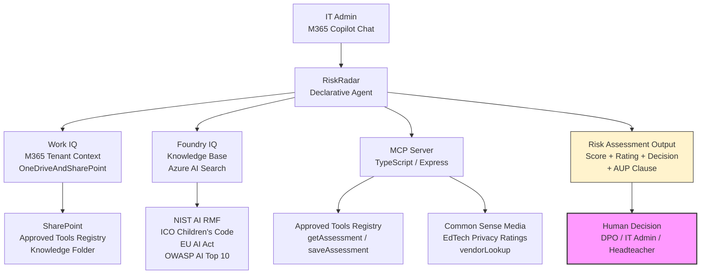

# RiskRadar

> A Microsoft 365 Copilot Declarative Agent that helps school IT administrators systematically assess AI tools for safety before deploying them to students.

---

## The Problem

Teachers are adopting AI tools into classrooms every week. School IT admins and Data Protection Officers have no systematic process for evaluating whether a tool is safe for students — data handling practices, age appropriateness, GDPR compliance, bias risk. Decisions happen ad hoc, inconsistently, and without an auditable record. No credible, free substitute exists for this specific workflow in the UK school context.

**RiskRadar gives every school a structured, evidence-based process for protecting students from harmful AI tools — replacing ad hoc decisions with an auditable framework that scales without consultancy cost.**

---

## What RiskRadar Does

An IT admin opens M365 Copilot Chat, names an AI tool, and RiskRadar walks through a structured assessment:

1. **Checks the registry** — calls `getAssessment` to surface any prior assessment (prevents duplicate work)
2. **Gathers information** — 6-question structured conversation covering data handling, vendor credentials, deployment context, and decision impact
3. **Scores across 5 dimensions** — grounded in the NIST AI RMF, citing ICO Children's Code and EU AI Act from the Foundry IQ knowledge base
4. **Retrieves vendor rating** — calls `vendorLookup` for the independent Common Sense Media EdTech Privacy grade
5. **Writes to the registry** — calls `saveAssessment` to persist the outcome to the school's Approved Tools Registry
6. **Delivers the output** — risk rating (Low / Medium / High / Critical), decision, suggested AUP clause, and a firm reminder that the output supports human judgment — it does not replace it

---

## Judging Evidence Map

| Criterion | Weight | Where to look |
|-----------|--------|--------------|
| **Accuracy & Relevance** | 20% | `data/knowledge/` — 4 Foundry IQ documents; `docs/demo-transcript.md` — every score cites a NIST AI RMF sub-category, ICO Children's Code standard, or EU AI Act article |
| **Reasoning & Multi-step** | 20% | `appPackage/instruction.txt` — 6-step conditional workflow, Work IQ personalisation, REDLINES logic; `docs/demo-transcript.md` — MCP tool chain shown with request/response JSON |
| **Reliability & Safety** | 20% | `appPackage/instruction.txt` REDLINES section; `evals/prompts.json` — 17 prompts including EU AI Act prohibited category, incomplete-information refusal, and 72-hour breach window; human-in-the-loop framing is structural, not a disclaimer |
| **Creativity & Originality** | 15% | School AI safety — no comparable submission in the track; REDLINES mechanic (halting assessment for prohibited tools) is a novel responsible-AI design pattern for Declarative Agents |
| **UX & Presentation** | 15% | `docs/demo-script.md` — narrated recording guide; `docs/demo-transcript.md` — natural conversation, not a form; copy-paste AUP clause; tone adapts to role (DPO vs teacher vs headteacher) |
| **Community Vote** | 10% | `docs/discord-post.md` — 3 post templates with Hack for Good framing; contact: babkek1337@gmail.com |

**Bonus criteria:**
- ✅ External MCP Server read: `getAssessment` reads from SharePoint Approved Tools Registry
- ✅ External MCP Server write: `saveAssessment` writes to SharePoint via Microsoft Graph API
- ✅ OAuth 2.0 on MCP server: `server/src/auth.ts` — Azure AD JWKS Bearer token validation; `OAuthPluginVault` in `ai-plugin.json`

---

## Architecture



**Human-in-the-loop is a design principle, not a disclaimer.** RiskRadar produces structured evidence for human review. No assessment is a pass/fail — every output explicitly recommends DPO or senior staff involvement for High/Critical ratings.

---

## Scoring Rubric

| Dimension | What It Measures |
|-----------|-----------------|
| Data Privacy | Data collection, storage location, retention, GDPR compliance |
| Age Appropriateness | Minimum age, content filters, safeguarding, ICO Children's Code |
| Transparency & Explainability | Vendor documentation, model explainability, audit trails |
| Bias & Fairness | Algorithmic fairness, demographic impact, testing evidence |
| Vendor Accountability | DPA availability, certifications (ISO 27001 / SOC 2), incident history |

Each dimension scored 1–5. Total 5–25. Risk rating bands:

| Score | Rating | Decision |
|-------|--------|----------|
| 21–25 | Low Risk | Approve (annual review) |
| 15–20 | Medium Risk | Approve with Controls (6-month review) |
| 8–14 | High Risk | Not Approved / Escalate to DPO |
| Below 8 | Critical Risk | Immediate DPO + headteacher escalation |

---

## MCP Tools

| Tool | Method | What It Does |
|------|--------|-------------|
| `getAssessment` | `POST /api/getAssessment` | Retrieves prior assessment from the Approved Tools Registry |
| `saveAssessment` | `POST /api/saveAssessment` | Writes a completed assessment to the registry |
| `vendorLookup` | `POST /api/vendorLookup` | Returns Common Sense Media EdTech Privacy grade for 18+ tools |

---

## Common Sense Media Coverage

18 EdTech tools pre-loaded with privacy grades, data collection summaries, and COPPA/GDPR flags:

| Grade | Tools |
|-------|-------|
| A (Excellent) | Google Classroom, Microsoft Teams for Education, Google Workspace for Education, Khan Academy, Seesaw |
| B (Good) | Grammarly, Duolingo, Canva, Kahoot, Microsoft Copilot, Nearpod, BrainPOP |
| C (Pass) | Gemini, Quizlet, Adobe Express, Notion AI |
| D (Poor) | ChatGPT (OpenAI), Turnitin |

---

## Knowledge Base (Foundry IQ)

Four documents in `data/knowledge/` — ready to upload to Azure AI Foundry. See [`appPackage/KNOWLEDGE_SETUP.md`](appPackage/KNOWLEDGE_SETUP.md) for step-by-step provisioning instructions.

| Document | Content |
|----------|---------|
| `risk_assessment_frameworks.md` | NIST AI RMF four functions, 5-dimension scoring rubric with per-level criteria, ICO Children's Code, EU AI Act prohibited/high-risk categories |
| `owasp_ai_top10.md` | OWASP Top 10 for LLMs (LLM01–LLM10) |
| `ai_security_cert_guide.md` | AI security certification pathways for school roles |
| `team_readiness_report.md` | Synthetic quarterly AI readiness report (demonstrates org-data surfacing) |

Once uploaded and indexed, the DA cites specific sections from these documents when justifying dimension scores.

---

## Responsible AI Design

RiskRadar is built around three responsible AI principles:

1. **Human-in-the-loop.** Every assessment output includes an explicit statement that the result supports — and does not replace — human judgment. High and Critical ratings require DPO review before any action.

2. **Conservative scoring under uncertainty.** When information is missing or ambiguous, the agent scores conservatively and tells the user exactly what additional information would change the score.

3. **EU AI Act compliance flags.** The agent explicitly identifies tools that may fall under the EU AI Act's prohibited or high-risk categories (emotional recognition, attention tracking, behavioural profiling of minors, biometric identification) and escalates automatically.

---

## Project Structure

```
riskradar/
├── appPackage/
│   ├── declarativeAgent.json   # DA manifest: instructions, capabilities, actions
│   ├── instruction.txt         # Full agent instructions (6-step workflow, scoring)
│   ├── ai-plugin.json          # 3 MCP tool definitions + runtime config
│   ├── manifest.json           # Teams app manifest v1.27
│   └── KNOWLEDGE_SETUP.md      # Step-by-step guide: fill in TODO values + upload docs
├── env/
│   └── .env.dev                # TEAMS_APP_ID, MCP_SERVER_URL (gitignored)
├── evals/
│   └── prompts.json            # 17 evaluation prompts covering edge cases
├── server/
│   ├── src/
│   │   ├── index.ts            # Express server, 3 MCP tool endpoints + OAuth middleware wiring
│   │   ├── auth.ts             # OAuth 2.0 Bearer token validation (Azure AD JWKS) — bonus criterion
│   │   ├── graph-store.ts      # Microsoft Graph API client — SharePoint list read/write via client_credentials
│   │   ├── store.ts            # Approved Tools Registry — routes to SharePoint when SP env vars set, file fallback for dev
│   │   └── ratings.ts          # Common Sense Media EdTech Privacy ratings (18 tools)
│   ├── package.json
│   └── tsconfig.json
└── m365agents.yml              # ATK provision/publish pipeline
```

---

## Setup: MCP Server

```bash
cd riskradar/server
npm install
npm run dev          # starts on http://localhost:3000
```

Test it:
```bash
curl -X POST http://localhost:3000/api/vendorLookup \
  -H "Content-Type: application/json" \
  -d '{"toolName": "ChatGPT"}'
```

### Running with a Public URL (required for M365 Copilot demo)

M365 Copilot runs on Microsoft's servers and cannot reach `localhost`. For a demo, expose the server with ngrok:

```bash
ngrok http 3000
# Copy the https:// URL (e.g. https://abc123.ngrok.io)
```

Then set `MCP_SERVER_URL` in `riskradar/env/.env.dev`:
```
MCP_SERVER_URL=https://abc123.ngrok.io/api
```

The `ai-plugin.json` runtime URL is templated from this value — re-run `teamsapp provision` after updating.

For a persistent public deployment, Railway or Render both support one-click Node.js deploys from this repo.

---

## Setup: Provision the Declarative Agent

Prerequisites:
- Microsoft 365 Copilot license (M365 Developer tenant works)
- Microsoft 365 Agents Toolkit (VS Code extension or CLI)
- Node.js 18, 20, or 22

1. **Fill in the TODO values** in `appPackage/declarativeAgent.json` and create `.env.dev`:
   - Follow the step-by-step guide in [`appPackage/KNOWLEDGE_SETUP.md`](appPackage/KNOWLEDGE_SETUP.md)
   - This covers: creating the SharePoint knowledge folder, uploading the 4 knowledge docs to Azure AI Foundry, and getting the Azure AI Search connection ID

2. **Set the MCP server URL:**
   ```
   # riskradar/env/.env.dev
   MCP_SERVER_URL=https://your-deployed-server.example.com/api
   ```

3. **Provision:**
   ```bash
   cd riskradar
   teamsapp provision --env dev
   ```

4. **Test in Copilot Chat:**
   Open M365 Copilot Chat → select the RiskRadar agent → use one of the conversation starters.

---

## Evaluation

17 evaluation prompts are included in `evals/prompts.json`, covering:

- Standard new tool assessment (ChatGPT, Grammarly, Canva)
- Tool already deployed to students (urgent escalation path)
- EU AI Act prohibited tool (emotion recognition / webcam tracking)
- Critical Risk scenario (biometric data + under-13s)
- Tool not in Common Sense Media database
- Vendor refusing to provide a DPA
- Vendor policy change triggering reassessment
- Home-use boundary question

Run evaluations with the M365 Copilot Agent Evaluations CLI:

```bash
npm install -g @microsoft/m365-copilot-eval
runevals --env dev
```

---

## Hack for Good

RiskRadar is built for the schools and IT admins who don't have a Chief Risk Officer, a data science team, or a budget for consultancy. It replaces ad hoc clipboard-and-gut-feel decisions with a structured, evidence-based process that:

- **Protects children** from AI tools that collect behavioural data, lack age-appropriate safeguards, or fall under EU AI Act prohibited categories
- **Creates an audit trail** schools can show to governors, Ofsted, and the ICO
- **Scales to every school** without additional cost — runs on M365 Copilot infrastructure

Every school that uses RiskRadar gains a systematic process that was previously only available to organisations with dedicated data protection teams.

---

## Learn More

- [Build Declarative Agents](https://learn.microsoft.com/microsoft-365-copilot/extensibility/build-declarative-agents)
- [Model Context Protocol (MCP)](https://modelcontextprotocol.io/)
- [NIST AI Risk Management Framework](https://www.nist.gov/artificial-intelligence)
- [ICO Children's Code](https://ico.org.uk/for-organisations/uk-gdpr-guidance-and-resources/childrens-information/childrens-code-guidance-and-resources/)
- [Common Sense Media EdTech Privacy](https://www.commonsense.org/education/privacy)
